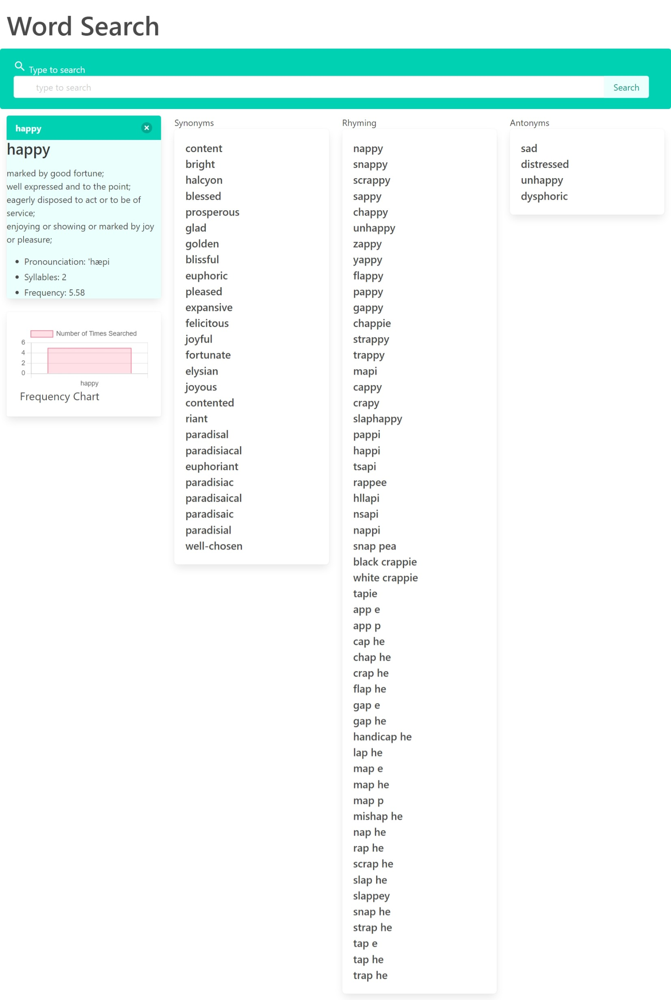

# Super-Team-Project

## Description

This is a word search application.  When searching for a word within the search bar you are given information regarding its definition, pronunciation, frequency, syllables, synonyms, rhyming words and antonyms.  The first card, When hovering over the pronunciation of the word, it gets highlighted and after clicking the word you will hear the pronunciation.  The frequency determines how often it is used.  The syllables determines how many syllables the word has. Followed by the definition of the word.  The second card containes the synonyms, which has a list of clickable words.  That will generate a modal with the same information from the first card related to the new word clicked on. The third card contains the rhyming words related to the origin word searched.  These words are also listed and clickable.   

## Usage

Type in a word and click the search button.

## Link to Deployed Application

[Deployed Application](https://cmcclay77.github.io/super-team-project/)

## Screenshot

## Testing

Check if its up to date occasionally

## License

Mit License

## Badges

## Contributing

## Credits