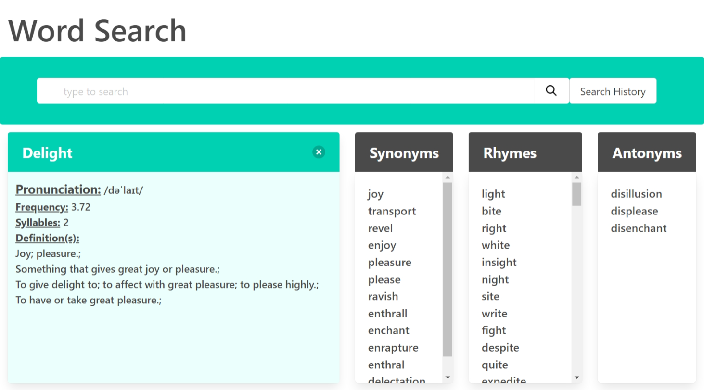

# Super-Team-Project

## Description

This is a word search application. Any Word searched will return a list of different synonyms, rhymes and antonyms.  The user will also have the pronunciation, frequency, syllables and definition of the word.  Every word listed within the synonyms, rhymes and antonyms cards are clickable and cause a modal to populate.  The modal gives the new word its definition, pronunciation, frequency and syllables.  Further, if clicked the new word is now searched.

## Usage

Step 1: type to search 
Step 2: press enter
Step 3: hidden content will appear with new information pertaining to the searched word
Step 4: 4 cards will appear
Step 5: First card will obtain its pronunciation, frequency, syllables and definition.
Step 6: when hovering over pronunciaton it will become highlighted and clickable.
Step 7: AFter clicking pronunciation a voice will appear pronouncing the word.

## Link to Deployed Application

[Deployed Application](https://cmcclay77.github.io/super-team-project/)

## Screenshot

## Testing

Check if its up to date occasionally

## License

Mit License

## Badges

## Contributing

## Credits